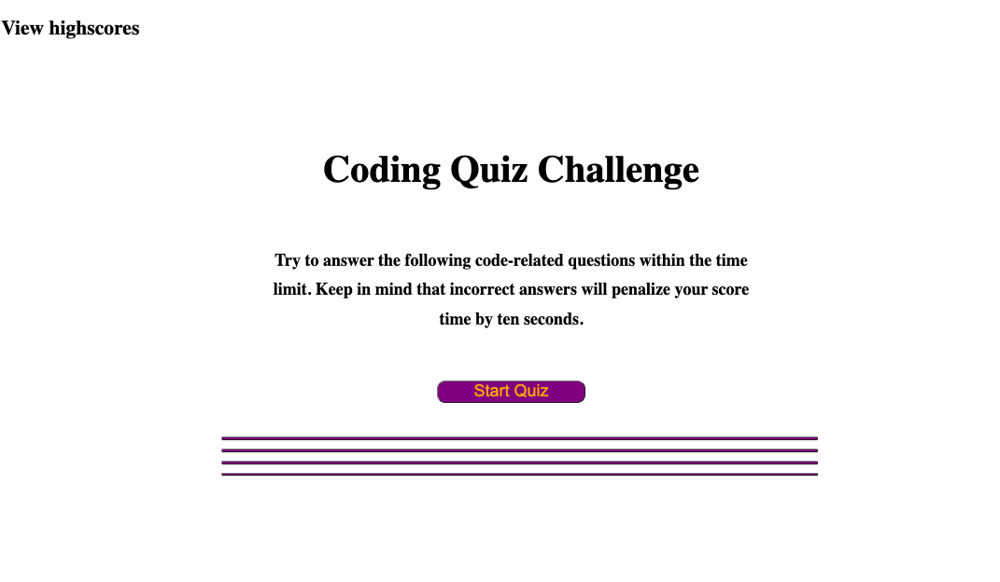
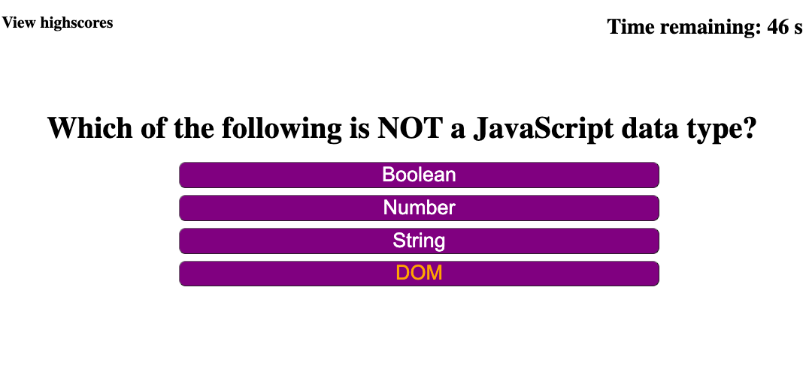

# Coding Quiz

## Description

I have created this coding quiz for students who wish to test themselves on information that covers topics such as HTML, CSS, and JavaScript. Although simplistic and quite short, the code reflects a program that is ble to modified and eventually have more questions added while still retaining is functionalities.

This is the starting page wit the title and instructions. The button underneath is clicked to begin the quiz and that's when the timer startdown from sixty seconds begins.

This is the first question and the choices displayed below. I have a total of four questions that are cycled through after the user selects a choice regardless if it is the correct choice or not. 

Here is a capture of the page that is displayed if the user runs out of time. 

## Deployment Link

https://antoniorobledo.github.io/Coding-Quiz/
